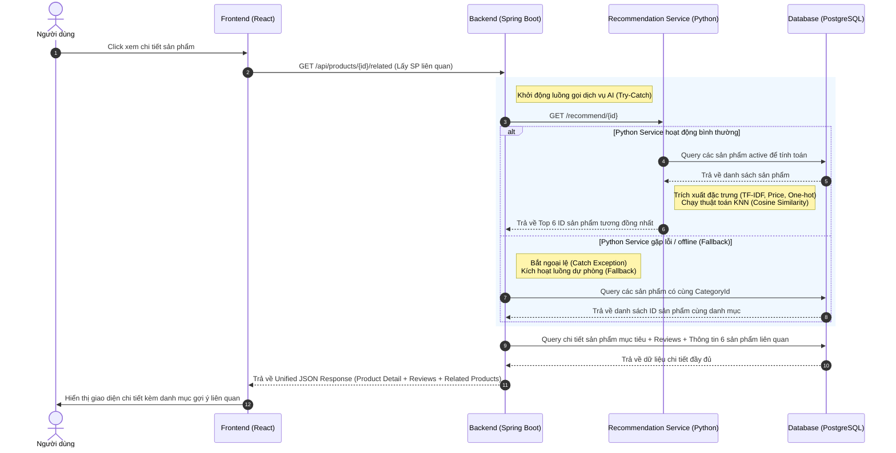

HỌC VIỆN CÔNG NGHỆ BƯU CHÍNH VIỄN THÔNG
KHOA CÔNG NGHỆ THÔNG TIN 1
BỘ MÔN THỰC TẬP CƠ SỞ

BÀI TẬP LỚN THỰC TẬP CƠ SỞ
DỰ ÁN: HỆ THỐNG BÁN ĐỒ THỂ THAO SPORTS4U 

Giảng viên hướng dẫn
: TS. Nguyễn Xuân Đức
Họ và tên sinh viên
: Trần Quang Lâm
Mã sinh viên
: B23DCCN480
Lớp
: D23CQCN04-B
Nhóm
: TTCS

Hà Nội – 2026

LỜI CẢM ƠN
Trong suốt quá trình học tập và thực hiện dự án Sports4U, em đã nhận được rất nhiều sự quan tâm, hỗ trợ và giúp đỡ từ quý thầy/cô, nhà trường cũng như những người xung quanh. Đây chính là nguồn động lực to lớn giúp em có thể hoàn thành đề tài một cách tốt nhất.
Trước hết, em xin gửi lời cảm ơn chân thành và sâu sắc đến quý thầy trong khoa đã tận tình giảng dạy, truyền đạt những kiến thức nền tảng và chuyên môn quý báu. Những kiến thức này không chỉ là cơ sở để em thực hiện dự án mà còn là hành trang quan trọng cho quá trình học tập và phát triển nghề nghiệp sau này.
Đặc biệt, em xin bày tỏ lòng biết ơn sâu sắc tới Thầy TS. Nguyễn Xuân Đức – người đã trực tiếp định hướng, góp ý và hỗ trợ em trong suốt quá trình thực hiện dự án. Thầy không chỉ giúp em hoàn thiện về mặt chuyên môn mà còn hướng dẫn em cách tư duy, tiếp cận và giải quyết vấn đề một cách logic và hiệu quả. Những nhận xét và góp ý quý báu của thầy/cô đã giúp em từng bước hoàn thiện sản phẩm cũng như nâng cao kỹ năng của bản thân.
Em cũng xin chân thành cảm ơn nhà trường đã tạo điều kiện thuận lợi về cơ sở vật chất, tài liệu học tập cũng như môi trường học tập hiện đại, giúp em có cơ hội nghiên cứu, thực hành và phát triển ý tưởng cho dự án.
Bên cạnh đó, em xin gửi lời cảm ơn đến bạn bè và những người xung quanh đã luôn động viên, chia sẻ kinh nghiệm và hỗ trợ em trong quá trình thực hiện đề tài. Sự giúp đỡ này đã góp phần không nhỏ vào việc hoàn thành dự án đúng tiến độ đề ra.
Trong quá trình thực hiện dự án Sports4U, em đã cố gắng vận dụng những kiến thức đã học để xây dựng và phát triển hệ thống một cách hoàn chỉnh nhất. Tuy nhiên, do hạn chế về mặt thời gian, kinh nghiệm thực tế cũng như kiến thức chuyên sâu, dự án không thể tránh khỏi những thiếu sót và hạn chế nhất định. Em rất mong nhận được những ý kiến đóng góp, nhận xét từ quý thầy/cô để có thể tiếp tục hoàn thiện và phát triển dự án trong tương lai.
Một lần nữa, em xin chân thành cảm ơn!

Mục lục
PHẦN 1: GIỚI THIỆU DỰ ÁN	5
1. Tổng quan dự án	5
2. Mục tiêu của dự án	5
3. Phạm vi hệ thống	5
4. Công nghệ và kiến trúc sử dụng	6
Phần 2: SRS	7
1. User Stories	7
1.1. Đối với Guest (Khách chưa đăng nhập)	7
1.2. Đối với User (Người dùng đã đăng nhập)	8
1.3. Đối với Admin (Quản trị viên)	11
2. User Cases	15
2.1. UC-01: Hiển thị sản phẩm trên trang Home	15
2.2. UC-02: Xem danh sách sản phẩm theo môn thể thao	18
2.3. UC-03: Xem chi tiết sản phẩm	21
2.4. UC-04: Đăng ký tài khoản	23
2.5. UC-05: Đăng nhập	25
2.6. UC-06: Thêm sản phẩm vào giỏ hàng	28
2.7. UC-07: Xem và cập nhật giỏ hàng	31
2.8. UC-08: Đặt hàng (Checkout)	33
2.9. UC-09: Thanh toán VNPay	36
2.10. UC-10: Xem lịch sử đơn hàng	38
2.11. UC-11: Hủy đơn hàng	39
2.12 UC-12: Admin quản lý tài khoản	41
2.13. UC-13: Admin quản lý danh mục	43
2.15. UC-15: Quản lý đơn hàng (Order Management)	48
2.16. UC-16: Xem thống kê tổng quan (Dashboard Summary)	51
2.17. UC-17: Thống kê doanh thu theo tháng	53
2.18. UC-18: Thống kê sản phẩm theo danh mục	54
2.19. UC-19: Thống kê đơn hàng 7 ngày gần nhất	55
Phần 3: Thiết kế cơ sở dữ liệu và API Docs	57
1. Thiết kế cơ sở dữ liệu	57
2. API Docs	62
2.1 Authen & Author API	62
2.2 Guest API	65
2.3 User API	68
2.4 Admin API	76
Phần 4: Giao diện	86
1. Giao diện Admin	86
2. Giao diện Guest	88
3. Giao diện User	90
Phần 5: Tổng kết	94
1. Kết quả đạt được	94
2. Hạn chế của hệ thống	94
3. Hướng phát triển trong tương lai	95
4. Kết luận	96

PHẦN 1: GIỚI THIỆU DỰ ÁN
1. Tổng quan dự án
Trong bối cảnh thương mại điện tử ngày càng phát triển mạnh mẽ, việc xây dựng các hệ thống bán hàng trực tuyến chuyên biệt đang trở thành xu hướng tất yếu. Dự án Sports4U được phát triển nhằm xây dựng một nền tảng thương mại điện tử chuyên cung cấp các sản phẩm thể thao như Pickleball, Badminton, Basketball và Tennis, đáp ứng nhu cầu mua sắm tiện lợi và nhanh chóng của người dùng.

2. Mục tiêu của dự án
Dự án được thực hiện với các mục tiêu chính sau:
Xây dựng một hệ thống thương mại điện tử hoàn chỉnh với đầy đủ chức năng cơ bản và nâng cao
Áp dụng kiến trúc tách biệt giữa Frontend và Backend nhằm tăng khả năng mở rộng và bảo trì
Tích hợp các công nghệ hiện đại như caching, message queue và thanh toán trực tuyến
Đảm bảo các yếu tố về bảo mật, hiệu năng và trải nghiệm người dùng
Vận dụng kiến thức đã học vào thực tế, đặc biệt trong lĩnh vực phát triển web và thiết kế hệ thống

3. Phạm vi hệ thống
Hệ thống Sports4U bao gồm ba thành phần chính:
Frontend: Giao diện người dùng được xây dựng bằng React JS (React 19), TypeScript, Vite và Tailwind CSS v4, áp dụng kiến trúc Feature-first giúp tối ưu hóa khả năng tái sử dụng component và quản lý state tập trung.
Backend: Hệ thống API được phát triển bằng Spring Boot, xử lý toàn bộ logic nghiệp vụ và giao tiếp với cơ sở dữ liệu.
Recommendation Service: Dịch vụ gợi ý sản phẩm liên quan chạy độc lập, giao tiếp với Backend thông qua các RESTful API.
Hệ thống phục vụ hai nhóm người dùng chính:
Người dùng (User): Thực hiện các chức năng mua sắm, quản lý tài khoản và đơn hàng. 
Quản trị viên (Admin): Quản lý sản phẩm, danh mục, người dùng và theo dõi hoạt động hệ thống.

4. Công nghệ và kiến trúc sử dụng
Dự án áp dụng nhiều công nghệ và giải pháp hiện đại nhằm nâng cao hiệu suất, khả năng mở rộng cũng như tối ưu hóa quy trình phát triển và triển khai:
Công nghệ Frontend:
TypeScript & React 19: Xây dựng giao diện người dùng hiện đại, đảm bảo tính an toàn kiểu dữ liệu và hiệu suất cao.
Vite: Công cụ build cực nhanh, tối ưu hóa quá trình phát triển.
Tailwind CSS v4: Framework CSS tiện lợi cho việc styling giao diện nhanh chóng và đồng bộ.
Zustand: Thư viện quản lý global state nhẹ và hiệu quả.
React Query / TanStack Query: Quản lý state caching, tối ưu hóa việc fetch dữ liệu và đồng bộ API.
Shadcn

Công nghệ Backend & Dịch vụ liên quan:
Spring Boot: Xây dựng RESTful API cho hệ thống Backend.
PostgreSQL: Quản lý dữ liệu quan hệ.
Redis: Caching dữ liệu và triển khai rate limiting.
RabbitMQ: Xử lý các tác vụ bất đồng bộ như gửi email.
JWT (có kết hợp Refresh Token): Xác thực, duy trì phiên đăng nhập an toàn và phân quyền người dùng.
Cloudinary: Lưu trữ hình ảnh trên nền tảng đám mây.
VNPay (Sandbox): Tích hợp thanh toán trực tuyến.
Recommendation Engine (FastAPI & Scikit-learn): Microservice Python chạy thuật toán học máy K-Nearest Neighbors (KNN) sử dụng khoảng cách Cosine để tính toán và gợi ý sản phẩm liên quan.

Deploy & DevOps:
Docker & Docker Compose: Container hóa toàn bộ hệ thống bao gồm PostgreSQL, Redis, RabbitMQ, Spring Boot Backend, React Frontend và Python Recommendation Service, giúp đồng nhất môi trường chạy trên mọi nền tảng.
GitHub Actions: Thiết lập các file cấu hình CI (Continuous Integration) gồm backend-ci.yml và frontend-ci.yml để tự động chạy kiểm thử và build dự án mỗi khi có push hoặc pull request, đảm bảo chất lượng mã nguồn liên tục.
Kiến trúc hệ thống được thiết kế theo hướng tách biệt Frontend - Backend, hướng tới khả năng mở rộng theo mô hình microservices trong tương lai
Phần 2: SRS 
1. User Stories
1.1. Đối với Guest (Khách chưa đăng nhập)
1.1.1. US-01: Xem danh sách sản phẩm
Mô tả:
Khách truy cập có thể xem danh sách các sản phẩm theo từng môn thể thao khác nhau.
Tiêu chí chấp nhận (Acceptance Criteria):
Hiển thị danh sách sản phẩm theo danh mục (Pickleball, Badminton, Basketball, Tennis)
Mỗi sản phẩm bao gồm: tên, giá, hình ảnh, số lượng còn lại
Giao diện hiển thị rõ ràng, dễ quan sát

1.1.2. US-02: Xem chi tiết sản phẩm và nhận gợi ý sản phẩm liên quan
Mô tả:
Khách có thể xem thông tin chi tiết của một sản phẩm cụ thể và nhận các gợi ý sản phẩm tương tự từ thuật toán học máy.
Tiêu chí chấp nhận:
Hiển thị đầy đủ thông tin: tên, giá, mô tả, xuất xứ
Có mô tả về ưu điểm nổi bật của sản phẩm
Hiển thị hình ảnh chi tiết của sản phẩm
Hiển thị danh sách 6 sản phẩm liên quan được tính toán thông qua thuật toán KNN.
Trong trường hợp dịch vụ Machine Learning gặp sự cố, danh sách sản phẩm liên quan vẫn tự động hiển thị dựa theo danh mục cùng loại của cơ sở dữ liệu (cơ chế Fallback).

1.1.3. US-03: Tìm kiếm sản phẩm
Mô tả:
Khách có thể tìm kiếm sản phẩm theo tên.
Tiêu chí chấp nhận:
Cho phép nhập từ khóa tìm kiếm
Kết quả trả về đúng các sản phẩm liên quan
Không phân biệt chữ hoa và chữ thường
Hiển thị danh sách kết quả phù hợp

1.2. Đối với User (Người dùng đã đăng nhập)
1.2.1. US-04: Đăng ký tài khoản
Mô tả:
Người dùng có thể tạo tài khoản mới bằng email và mật khẩu.
Tiêu chí chấp nhận:
Nhập email và mật khẩu hợp lệ
Email không được trùng với hệ thống
Đăng ký thành công khi hợp lệ
Hiển thị lỗi nếu email đã tồn tại

1.2.2. US-05: Đăng nhập
Mô tả:
Người dùng đăng nhập vào hệ thống.
Tiêu chí chấp nhận:
Đúng thông tin → chuyển về trang chủ
Sai thông tin → hiển thị lỗi
Áp dụng rate limiting đăng nhập
Khóa tài khoản tạm thời nếu đăng nhập sai nhiều lần
Xác thực bằng JWT

1.2.3. US-06: Quên mật khẩu (OTP)
Mô tả:
Người dùng đặt lại mật khẩu thông qua OTP gửi qua email.
Tiêu chí chấp nhận:
Nhập email đã đăng ký
Hệ thống gửi OTP qua email
OTP có thời hạn
Nhập OTP hợp lệ → cho phép đặt lại mật khẩu

1.2.4. US-07: Gửi lại OTP
Mô tả:
Người dùng có thể yêu cầu gửi lại OTP.
Tiêu chí chấp nhận:
Cho phép gửi lại OTP
OTP cũ bị vô hiệu hóa
OTP mới được gửi qua email

1.2.5. US-08: Quản lý thông tin cá nhân
Mô tả:
Người dùng có thể xem và cập nhật thông tin cá nhân.
Tiêu chí chấp nhận:
Xem thông tin cá nhân
Cập nhật địa chỉ, số điện thoại
Lưu thay đổi thành công

1.2.6. US-09: Thêm sản phẩm vào giỏ hàng
Mô tả:
Người dùng thêm sản phẩm vào giỏ hàng.
Tiêu chí chấp nhận:
Chọn số lượng sản phẩm
Nếu đủ hàng → thêm thành công
Nếu vượt tồn kho → hiển thị lỗi
Cập nhật database
1.2.7. US-10: Xem giỏ hàng
Mô tả:
Người dùng xem các sản phẩm trong giỏ hàng.
Tiêu chí chấp nhận:
Hiển thị danh sách sản phẩm
Hiển thị số lượng
Hiển thị tổng tiền

1.2.8. US-11: Cập nhật giỏ hàng
Mô tả:
Người dùng chỉnh sửa giỏ hàng.
Tiêu chí chấp nhận:
Xóa sản phẩm khỏi giỏ
Cập nhật lại tổng tiền
Đồng bộ dữ liệu

1.2.9. US-12: Đặt hàng
Mô tả:
Người dùng thực hiện đặt hàng.
Tiêu chí chấp nhận:
Nếu chưa có thông tin giao hàng → yêu cầu nhập
Nếu đã có → đặt hàng ngay
Lưu đơn hàng vào hệ thống
Hiển thị thông báo thành công

1.2.10. US-13: Thanh toán đơn hàng (VNPay)
Mô tả:
Người dùng thanh toán đơn hàng trực tuyến qua VNPay.
Tiêu chí chấp nhận:
Chọn phương thức VNPay
Redirect sang cổng thanh toán
VNPay callback về hệ thống
Verify chữ ký hợp lệ
Cập nhật trạng thái thanh toán
Hiển thị kết quả

1.2.11. US-14: Xem lịch sử đơn hàng
Mô tả:
Người dùng xem các đơn hàng đã đặt.
Tiêu chí chấp nhận:
Hiển thị danh sách đơn hàng
Xem chi tiết đơn
Hiển thị trạng thái đơn hàng
Hiển thị thông tin thanh toán

1.2.12. US-15: Hủy đơn hàng
Mô tả:
Người dùng có thể hủy đơn hàng.
Tiêu chí chấp nhận:
Chỉ cho phép hủy khi trạng thái là PENDING
Cập nhật trạng thái thành CANCELLED
Hiển thị thông báo thành công

1.2.13. Đăng xuất (Logout) an toàn
Mô tả: Người dùng có thể đăng xuất khỏi hệ thống để kết thúc phiên làm việc và bảo mật tài khoản.
Tiêu chí chấp nhận (Acceptance Criteria):
Cung cấp nút Đăng xuất trên giao diện người dùng.
Khi người dùng xác nhận đăng xuất, hệ thống thu hồi/xóa Refresh Token tương ứng trong Database.
Xóa sạch Cookie chứa Refresh Token (HttpOnly) trên trình duyệt.
Giải phóng Access Token ở phía Frontend (State/Storage).
Chuyển hướng (redirect) người dùng về trang chủ hoặc trang đăng nhập.
1.2.14. Tự động duy trì phiên đăng nhập (Refresh Token)
Mô tả: Hệ thống tự động lấy Access Token mới bằng Refresh Token lưu trong HttpOnly Cookie mà không cần bắt người dùng đăng nhập lại khi Access Token hết hạn, đảm bảo trải nghiệm liền mạch.
Tiêu chí chấp nhận:
Luồng chạy ngầm phía Frontend tự động phát hiện Access Token hết hạn (thông qua mã lỗi 401 Unauthorized).
Tự động gửi request làm mới token đính kèm Refresh Token qua HttpOnly Cookie.
Hệ thống xác thực Refresh Token hợp lệ và cấp lại Access Token mới.
Trường hợp Refresh Token đã hết hạn hoặc không hợp lệ, hệ thống buộc người dùng phải đăng nhập lại.
1.2.15. Viết đánh giá sản phẩm (Product Review)
Mô tả: Người dùng có thể chấm điểm (1 - 5 sao) và viết bình luận đánh giá cho sản phẩm nhằm chia sẻ trải nghiệm sử dụng.
Tiêu chí chấp nhận:
Chỉ người dùng đã mua và hoàn thành đơn hàng chứa sản phẩm đó mới có quyền đánh giá.
Cho phép chọn mức đánh giá từ 1 đến 5 sao và nhập nội dung bình luận.
Lưu thông tin đánh giá vào hệ thống thành công.
Cập nhật và hiển thị điểm đánh giá trung bình mới của sản phẩm.

1.3. Đối với Admin (Quản trị viên)
1.3.1. US-16: Quản lý tài khoản người dùng
Mô tả:
Admin có thể tạo, cập nhật, khóa/mở khóa và xem danh sách tài khoản người dùng.
Tiêu chí chấp nhận:
Tài khoản mới (kiểm tra mật khẩu nhập lại phải khớp)
Cập nhật thông tin tài khoản theo ID
Khóa tài khoản (disable)
Mở khóa tài khoản
Xem danh sách tài khoản (có phân trang)
Lọc theo trạng thái (status) và vai trò (ROLE_USER, ROLE_ADMIN)
Không hiển thị mật khẩu

1.3.2. US-17: Quản lý danh mục sản phẩm
Mô tả:
Admin quản lý danh mục và cấu trúc cây danh mục.
Tiêu chí chấp nhận:
Thêm danh mục mới
Xem danh sách danh mục cha (có phân trang)
Xem danh mục con theo danh mục cha
Xem toàn bộ danh mục con
Xóa danh mục (soft delete)
Không hiển thị danh mục đã bị xóa

1.3.3. US-18: Quản lý sản phẩm
Mô tả:
Admin quản lý sản phẩm với đầy đủ thông tin và hình ảnh.
Tiêu chí chấp nhận:
Thêm sản phẩm mới (multipart gồm data + image)
Upload ảnh sản phẩm
Cập nhật sản phẩm (có thể cập nhật ảnh hoặc không)
Xóa sản phẩm (soft delete)
Tìm kiếm sản phẩm theo keyword
Lọc sản phẩm theo:
Danh mục
Trạng thái tồn kho
Khoảng giá (minPrice → maxPrice)
Phân trang kết quả

1.3.4. US-19: Xem sản phẩm theo danh mục
Mô tả:
Admin xem danh sách sản phẩm thuộc một danh mục cụ thể.
Tiêu chí chấp nhận:
Lấy sản phẩm theo categoryId
Có phân trang
Hiển thị đầy đủ thông tin sản phẩm
Xử lý lỗi nếu danh mục không tồn tại

1.3.5. US-20: Quản lý đơn hàng
Mô tả:
Admin theo dõi và xử lý đơn hàng trong hệ thống.
Tiêu chí chấp nhận:
Xem danh sách đơn hàng (có phân trang)
Lọc theo:
Trạng thái đơn hàng
Trạng thái thanh toán
Cập nhật trạng thái đơn hàng
Xử lý lỗi nếu trạng thái không hợp lệ

1.3.6. US-21: Thống kê tổng quan hệ thống (Dashboard Summary)
Mô tả:
Admin xem tổng quan hệ thống.
Tiêu chí chấp nhận:
Hiển thị:
Tổng số người dùng
Tổng số sản phẩm
Tổng số đơn hàng
Trả dữ liệu nhanh (có thể cache Redis)

1.3.7. US-22: Thống kê doanh thu theo tháng
Mô tả:
Admin xem doanh thu theo từng tháng trong năm.
Tiêu chí chấp nhận:
Nhập năm cần thống kê
Hiển thị doanh thu theo 12 tháng
Dữ liệu chính xác theo đơn hàng đã thanh toán

1.3.8. US-23: Thống kê sản phẩm theo danh mục
Mô tả:
Admin xem số lượng sản phẩm theo từng danh mục.
Tiêu chí chấp nhận:
Hiển thị số lượng sản phẩm theo từng category
Dữ liệu hỗ trợ hiển thị biểu đồ (Chart.js)

1.3.9. US-24: Thống kê đơn hàng 7 ngày gần nhất
Mô tả:
Admin theo dõi hoạt động đơn hàng gần đây.
Tiêu chí chấp nhận:
Hiển thị số lượng đơn hàng theo từng ngày (7 ngày gần nhất)
Dữ liệu chính xác theo thời gian thực hoặc cache ngắn hạn

1.3.10. US-XX: Xem thống kê sản phẩm đã bán
Mô tả: Admin xem số lượng và tần suất mua của từng sản phẩm cụ thể để tối ưu hóa nguồn hàng và chiến lược kinh doanh.
Tiêu chí chấp nhận:
Hiển thị danh sách các sản phẩm bán chạy nhất.
Thống kê chính xác số lượng sản phẩm đã bán và tần suất mua trong khoảng thời gian được chọn.
Giao diện hỗ trợ lọc, sắp xếp (theo số lượng bán, doanh thu mang lại) và phân trang rõ ràng.

2. User Cases
	
Sơ đồ UC toàn hệ thống

2.1. UC-01: Hiển thị sản phẩm trên trang Home
Tác nhân (Actor):
Guest
User
Mô tả Use Case:
Use Case này mô tả quá trình hệ thống hiển thị danh sách sản phẩm trên trang chủ, đồng thời hỗ trợ người dùng tìm kiếm và xem chi tiết sản phẩm.
Tiền điều kiện (Pre-condition):
Người dùng truy cập được vào hệ thống
Hệ thống có dữ liệu sản phẩm trong cơ sở dữ liệu
Hậu điều kiện (Post-condition):
Danh sách sản phẩm được hiển thị theo từng môn thể thao
Người dùng có thể tiếp tục tìm kiếm hoặc xem chi tiết sản phẩm
Luồng chính (Main Flow):
Người dùng (Guest/User) truy cập vào trang Home.
Hệ thống hiển thị danh sách sản phẩm theo từng môn thể thao (có giới hạn số lượng hiển thị cho mỗi danh mục).
Người dùng có thể:
Cuộn trang để xem thêm các danh mục khác
Click vào một sản phẩm để xem chi tiết
Nhập từ khóa để tìm kiếm sản phẩm
Hệ thống tiếp nhận yêu cầu (xem chi tiết hoặc tìm kiếm) và xử lý tương ứng.

Sơ đồ Use Case hiển thị sản phẩm trên trang Home
	

Sequence Diagaram:
Luồng xử lý hệ thống (System Flow):
Bước 1: Người dùng truy cập vào trang Home hoặc nhập từ khóa tìm kiếm.
Bước 2: Giao diện (Frontend) gửi request đến Backend Server, kèm theo các tham số như:
Danh mục sản phẩm (môn thể thao)
Từ khóa tìm kiếm (nếu có)
Bước 3: Backend Server xử lý request và thực hiện truy vấn xuống Database để lấy dữ liệu sản phẩm, bao gồm:
Tên sản phẩm (Name)
Giá (Price)
Hình ảnh (Image)
Số lượng tồn kho (Stock)
Bước 4: Database trả kết quả về cho Backend Server.
Bước 5: Backend Server xử lý dữ liệu và trả response về Frontend.
Bước 6: Frontend hiển thị danh sách sản phẩm lên giao diện cho người dùng.

Luồng ngoại lệ:
Ngoại lệ 1: Bước 3 và 4 người dùng nhập từ khóa không tồn tại hoặc danh mục lựa chọn hiện đang không có sản phẩm nào
	🡺 Giao diện hiển thị lên màn hình:
		“Không tìm thấy sản phẩm nào phù hợp với từ khóa/danh mục của bạn” 

2.2. UC-02: Xem danh sách sản phẩm theo môn thể thao
Tác nhân (Actor):
Guest
User
Mô tả:
Use Case này mô tả quá trình người dùng xem danh sách đầy đủ các sản phẩm thuộc một môn thể thao cụ thể từ trang Home.
Tiền điều kiện (Pre-condition):
Người dùng đang ở trang Home
Hệ thống có dữ liệu sản phẩm theo từng môn thể thao
Hậu điều kiện (Post-condition):
Danh sách sản phẩm theo môn thể thao được hiển thị
Người dùng có thể tiếp tục xem chi tiết hoặc thực hiện các thao tác khác

Luồng chính (Main Flow):
Người dùng truy cập vào trang Home.
Người dùng chọn chức năng “View All” tại một danh mục môn thể thao.
Hệ thống chuyển hướng (redirect) sang trang danh sách sản phẩm theo môn thể thao đã chọn.
Hệ thống hiển thị danh sách đầy đủ các sản phẩm thuộc môn thể thao đó.
Người dùng có thể:
Cuộn trang để xem thêm sản phẩm
Click vào sản phẩm để xem chi tiết

Sơ đồ use case xem tất cả sản phẩm của danh mục

- Sequence diagram:
Luồng xử lý hệ thống (System Flow):
Bước 1: Người dùng truy cập vào trang Home hoặc nhập từ khóa tìm kiếm.
Bước 2: Giao diện (Frontend) gửi request đến Backend Server, kèm theo các tham số như:
Danh mục sản phẩm (môn thể thao)
Từ khóa tìm kiếm (nếu có)
Bước 3: Backend Server xử lý request và thực hiện truy vấn xuống Database để lấy dữ liệu sản phẩm, bao gồm:
Tên sản phẩm (Name)
Giá (Price)
Hình ảnh (Image)
Số lượng tồn kho (Stock)
Bước 4: Database trả kết quả về cho Backend Server.
Bước 5: Backend Server xử lý dữ liệu và trả response về Frontend.
Bước 6: Frontend hiển thị danh sách sản phẩm lên giao diện cho người dùng.

Luồng ngoại lệ:
Ngoại lệ 1: Bước 3 và 4 người dùng nhập từ khóa không tồn tại hoặc danh mục lựa chọn hiện đang không có sản phẩm nào
	🡺 Giao diện hiển thị lên màn hình:
		“Không tìm thấy sản phẩm nào phù hợp với từ khóa/danh mục của bạn” 

2.3. UC-03: Xem chi tiết sản phẩm
Tác nhân (Actor):
Guest
User
Mô tả:
Use Case này mô tả quá trình người dùng xem thông tin chi tiết của một sản phẩm cụ thể và nhận các sản phẩm liên quan từ hệ gợi ý KNN.
Tiền điều kiện (Pre-condition):
Người dùng đã truy cập vào hệ thống (trang Home hoặc trang danh sách sản phẩm)
Sản phẩm tồn tại trong hệ thống
Hậu điều kiện (Post-condition):
Thông tin chi tiết sản phẩm và danh sách sản phẩm liên quan được hiển thị thành công.
Luồng chính (Main Flow):
Người dùng truy cập vào danh sách sản phẩm (từ Home hoặc tìm kiếm).
Người dùng click vào một sản phẩm bất kỳ.
Hệ thống chuyển hướng (redirect) sang trang chi tiết sản phẩm.
Hệ thống hiển thị đầy đủ thông tin sản phẩm.
Sau khi hiển thị đầy đủ thông tin chi tiết sản phẩm, giao diện hiển thị thêm danh sách các đánh giá của người dùng khác (bao gồm số sao, nội dung bình luận, tên người đánh giá).
Hiển thị thêm mục "Sản phẩm liên quan", liệt kê danh sách các sản phẩm gợi ý do Python Recommendation Service (hoặc Database Fallback) cung cấp.
Người dùng có thể:
Thêm sản phẩm vào giỏ hàng
Thực hiện mua ngay

Sơ đồ use case xem chi tiết sản phẩm:

- Sequence diagram:
Luồng xử lý hệ thống (System Flow):
* **Bước 1:** Người dùng click vào một sản phẩm từ danh sách.
* **Bước 2:** Frontend gửi request lấy chi tiết và sản phẩm liên quan đến Backend (Spring Boot) kèm theo `productId`.
* **Bước 3:** Backend Server tiếp nhận request và bắt đầu thực hiện song song:
  * a. Truy vấn cơ sở dữ liệu để lấy thông tin chi tiết sản phẩm và danh sách đánh giá (reviews).
  * b. Gửi một REST request `GET /recommend/{productId}` tới dịch vụ **Python Recommendation Service** để tính toán độ tương đồng và lấy ra 6 ID sản phẩm liên quan tốt nhất.
  * **Cơ chế Fallback (Bảo vệ hệ thống):** Trong trường hợp dịch vụ gợi ý gặp sự cố (Kết nối lỗi, Timeout, Service Down), Backend tự động kích hoạt cơ chế Fallback trong khối `catch` để thực hiện câu truy vấn SQL dự phòng lấy ra các sản phẩm cùng danh mục (`CategoryId`) từ Database.
* **Bước 4:** Backend truy cập DB để tổng hợp thông tin chi tiết của 6 sản phẩm liên quan dựa vào danh sách ID nhận được từ bước 3.
* **Bước 5:** Backend trả response JSON hợp nhất (Product Detail + Reviews + Related Products) về cho Frontend.
* **Bước 6:** Frontend (React) nhận dữ liệu và hiển thị chi tiết sản phẩm kèm phần "Sản phẩm liên quan" cho người dùng.

2.4. UC-04: Đăng ký tài khoản
Tác nhân (Actor):
Guest
Mô tả:
Use Case này mô tả quá trình khách (Guest) tạo tài khoản mới trên hệ thống bằng email và mật khẩu.
Tiền điều kiện (Pre-condition):
Người dùng chưa có tài khoản trong hệ thống
Người dùng truy cập được vào trang đăng ký
Hậu điều kiện (Post-condition):
Tài khoản mới được tạo thành công nếu thông tin hợp lệ
Hoặc hiển thị thông báo lỗi nếu email đã tồn tại
Luồng chính (Main Flow):
Guest chọn chức năng Đăng ký trên giao diện.
Người dùng nhập email, mật khẩu (và nhập lại mật khẩu nếu có).
Người dùng nhấn Submit để gửi thông tin đăng ký.
Hệ thống kiểm tra tính hợp lệ của dữ liệu.
Nếu email chưa tồn tại → tạo tài khoản mới.
Hệ thống hiển thị thông báo đăng ký thành công.

Sơ đồ use case chức năng đăng ký tài khoản

- Sequence diagram:
Luồng xử lý hệ thống (System Flow):
Bước 1: Người dùng nhập email, mật khẩu và nhấn Submit trên giao diện.
Bước 2: Frontend gửi request đăng ký tài khoản đến Backend Server.
Bước 3: Backend Server kiểm tra email đã tồn tại trong Database hay chưa.
Bước 4: Database trả kết quả kiểm tra (tồn tại hoặc chưa).
Bước 5 (Trường hợp email đã tồn tại):
Backend trả về thông báo lỗi: “Email đã tồn tại”
Frontend hiển thị lỗi cho người dùng
Bước 6 (Trường hợp email hợp lệ):
Backend tiến hành lưu thông tin tài khoản mới vào Database
Mật khẩu được mã hóa (BCrypt) trước khi lưu
Bước 7: Database xác nhận lưu thành công.
Bước 8: Backend trả response thành công về Frontend.
Bước 9: Frontend hiển thị thông báo “Đăng ký thành công”.

Luồng ngoại lệ: 
Ngoại lệ 1: Bước 5 trường hợp email đã tồn tại:
	🡺 Giao diện hiển thị lỗi “Email đã tồn tại”

2.5. UC-05: Đăng nhập
Tác nhân (Actor):
User
Mô tả:
Use Case này mô tả quá trình người dùng đăng nhập vào hệ thống bằng email và mật khẩu, đồng thời hệ thống thực hiện xác thực, cấp token và áp dụng các cơ chế bảo mật.

Tiền điều kiện (Pre-condition):
Người dùng đã có tài khoản hợp lệ
Tài khoản chưa bị khóa

Hậu điều kiện (Post-condition):
Người dùng đăng nhập thành công và được cấp JWT token
Hoặc nhận thông báo lỗi nếu thông tin không hợp lệ
Luồng chính (Main Flow):
Người dùng nhập email và mật khẩu trên giao diện đăng nhập.
Người dùng nhấn Submit.
Hệ thống gửi yêu cầu xác thực đến Backend.
Backend kiểm tra thông tin tài khoản.
Nếu hợp lệ → tạo JWT token.
Hệ thống trả về kết quả đăng nhập thành công.
Frontend lưu token và chuyển hướng về trang Home.

Sơ đồ use case người dùng đăng nhập

- Sequence diagram:
Luồng xử lý hệ thống (System Flow):
Bước 1: Người dùng nhập thông tin đăng nhập trên giao diện.
Bước 2: Frontend gửi request đăng nhập đến Backend Server.
Bước 3: Backend kiểm tra:
Tài khoản có tồn tại không
Tài khoản có đang bị khóa không
Bước 4: Backend truy vấn Database để lấy thông tin người dùng.
Bước 5: So sánh mật khẩu nhập vào với mật khẩu đã mã hóa (BCrypt).
Bước 6 (Nếu sai thông tin):
Tăng số lần đăng nhập sai (lưu bằng Redis)
Nếu vượt quá giới hạn → khóa tài khoản tạm thời
Trả về thông báo lỗi
Bước 7 (Nếu đúng thông tin):
Reset số lần đăng nhập sai
Tạo JWT token
Trả token về cho Frontend
Bước 8: Frontend lưu token và redirect về trang Home.

Luồng ngoại lệ:
Ngoại lệ 1: Người dùng nhập sai thông tin
	🡺 Hệ thống gửi về thông báo “Sai thông tin đăng nhập”
Ngoại lệ 2: Người dùng nhập sai quá số lượt
	🡺 Hệ thống gửi về thông báo “Tài khoản đã bị khóa”

2.6. UC-06: Thêm sản phẩm vào giỏ hàng
Tác nhân (Actor):
User 
Mô tả:
Use Case này mô tả quá trình người dùng thêm sản phẩm vào giỏ hàng, bao gồm kiểm tra thông tin cá nhân và số lượng tồn kho trước khi thực hiện.
Tiền điều kiện (Pre-condition):
Người dùng đã đăng nhập 
Sản phẩm tồn tại trong hệ thống 
Hậu điều kiện (Post-condition):
Sản phẩm được thêm vào giỏ hàng nếu hợp lệ 
Hoặc hiển thị lỗi nếu không thỏa điều kiện
Luồng chính (Main Flow):
Người dùng chọn sản phẩm và số lượng. 
Người dùng nhấn “Thêm vào giỏ hàng”. 
Hệ thống kiểm tra thông tin cá nhân (Profile). 
Hệ thống kiểm tra số lượng tồn kho. 
Nếu hợp lệ → thêm sản phẩm vào giỏ hàng. 
Cập nhật lại số lượng tồn kho. 
Hiển thị thông báo thêm thành công. 
		
Sơ đồ use case chức năng thêm sản phẩm vào giỏ hàng

- Sequence diagram:
Luồng xử lý hệ thống (System Flow):
Bước 1: Người dùng chọn số lượng và nhấn “Thêm vào giỏ hàng”.
Bước 2: Frontend gửi request đến Backend, gồm:
productId 
quantity 
Bước 3: Backend kiểm tra thông tin cá nhân (Profile) của user trong Database.
Bước 4 (Nếu chưa có Profile):
Backend trả yêu cầu bổ sung thông tin 
Frontend redirect sang trang nhập thông tin 
Bước 5: Backend kiểm tra số lượng tồn kho của sản phẩm.
Bước 6 (Nếu vượt quá tồn kho):
Trả lỗi “Vượt quá số lượng” 
Hiển thị thông báo lỗi 
Bước 7 (Nếu hợp lệ):
Thêm sản phẩm vào giỏ hàng 
Cập nhật lại số lượng tồn kho 
Bước 8: Database xác nhận cập nhật thành công.
Bước 9: Backend trả response thành công.
Bước 10: Frontend hiển thị thông báo “Thêm vào giỏ hàng thành công”.

Luồng ngoại lệ:
Ngoại lệ 1: User chưa đăng nhập
	🡺 Hệ thống thông báo: “Vui lòng đăng nhập để thêm sản phẩm vào giỏ hàng”
Ngoại lệ 2: Số lượng sản phẩm muốn thêm vào vượt quá số lượng tồn kho
	🡺 Hệ thống thông báo: “Vượt quá số lượng sản phẩm hiện có”

2.7. UC-07: Xem và cập nhật giỏ hàng
Tác nhân (Actor):
User 
Mô tả:
Use Case này mô tả quá trình người dùng xem danh sách sản phẩm trong giỏ hàng, tổng tiền và thực hiện các thao tác cập nhật như xóa sản phẩm.

Tiền điều kiện (Pre-condition):
Người dùng đã đăng nhập 
Người dùng đã có sản phẩm trong giỏ hàng (có thể rỗng) 

Hậu điều kiện (Post-condition):
Danh sách giỏ hàng được hiển thị 
Giỏ hàng được cập nhật khi người dùng thực hiện thao tác
Luồng chính (Main Flow):
Người dùng truy cập vào trang Giỏ hàng. 
Hệ thống hiển thị danh sách, chi tiết sản phẩm trong giỏ hàng. 
Hệ thống hiển thị tổng số tiền của giỏ hàng. 
Người dùng có thể thực hiện thao tác: 
Xóa sản phẩm khỏi giỏ hàng 
Hệ thống cập nhật lại giỏ hàng và tổng tiền

Sơ đồ use case chức năng xem và cập nhật giỏ hàng

- Sequence diagram:
	Luồng xử lý hệ thống (System Flow):
	Bước 1: Người dùng truy cập vào trang Giỏ hàng.
	Bước 2: Frontend gửi request lấy danh sách giỏ hàng đến Backend.
	Bước 3: Backend truy vấn Database để lấy danh sách sản phẩm trong giỏ hàng 	của user.
	Bước 4: Backend tính toán tổng tiền dựa trên danh sách sản phẩm.
	Bước 5: Backend trả dữ liệu (danh sách sản phẩm + tổng tiền) về Frontend.
	Bước 6: Frontend hiển thị giỏ hàng cho người dùng.
	Bước 7: Người dùng chọn xóa một sản phẩm khỏi giỏ hàng.
	Bước 8: Frontend gửi request xóa sản phẩm (theo cartItemId hoặc productId) 	đến Backend.
	Bước 9: Backend thực hiện xóa sản phẩm trong Database.
	Bước 10: Database xác nhận xóa thành công.
	Bước 11: Backend trả kết quả về Frontend.
	Bước 12: Frontend cập nhật lại danh sách giỏ hàng và tổng tiền.

Luồng ngoại lệ:
- Ngoại lệ 1: Người dùng thay đổi số lượng sản phẩm vượt quá số lượng sản phẩm tồn kho
	🡺 Hệ thống thông báo “Số lượng sản phẩm đã chọn vượt quá số lượng hiện có”

2.8. UC-08: Đặt hàng (Checkout) 
Tác nhân (Actor):
User 
Mô tả:
Người dùng thực hiện đặt hàng từ giỏ hàng hoặc mua ngay sản phẩm.
Tiền điều kiện:
Người dùng đã đăng nhập 
Giỏ hàng có sản phẩm 
Hậu điều kiện:
Đơn hàng được tạo với trạng thái PENDING 

Sơ đồ use case đặt hàng

- Sequence diagram:
Luồng xử lý hệ thống (System Flow):
Bước 1: FE → BE: Lấy danh sách sản phẩm trong giỏ
Bước 2: BE → DB: Query cart items
Bước 3: Backend kiểm tra:
Thông tin giao hàng 
Số lượng tồn kho 
Bước 4 (Nếu hợp lệ):
BE → DB: Tạo Order 
BE → DB: Tạo OrderDetail 
BE → DB: Trừ kho 
Bước 5: DB xác nhận
Bước 6: BE trả response thành công
Bước 7: FE hiển thị thông báo

	
Luồng ngoại lệ:
- Ngoại lệ 1: Số lượng sản phẩm lúc đặt vượt quá số lượng tồn kho:
	🡺 Hệ thống thông báo “Số lượng sản phẩm đã chọn vượt quá số lượng hiện có”

2.9. UC-09: Thanh toán VNPay
Tác nhân:
User 
VNPay (External System) 
Mô tả:
Người dùng thanh toán đơn hàng thông qua VNPay.
Tiền điều kiện:
Đã có đơn hàng (PENDING) 
Hậu điều kiện:
Cập nhật trạng thái thanh toán (PAID / FAILED) 
Luồng chính:
User chọn thanh toán VNPay 
Hệ thống tạo URL thanh toán 
Redirect sang VNPay 
User thanh toán 
VNPay callback về hệ thống 
Xác thực chữ ký 
Cập nhật trạng thái đơn

Sơ đồ use case chức năng thanh toán vnpay

- Sequence diagram:
System Flow:
Bước 1: FE → BE: Request payment
Bước 2: BE tạo URL VNPay
Bước 3: FE redirect user sang VNPay
Bước 4: User thực hiện thanh toán
Bước 5: VNPay → BE: Callback
Bước 6: Backend verify chữ ký
Bước 7:
Nếu hợp lệ → cập nhật PAID 
Nếu sai → cập nhật FAILED

Luồng ngoại lệ:
- Ngoại lệ: Tài khoản thanh toán không đủ số dư hoặc tài khoản thanh toán bị khóa
	🡺 Hệ thống thông báo lỗi tương ứng cho người dùng
2.10. UC-10: Xem lịch sử đơn hàng
Tác nhân:
User 
Mô tả:
Người dùng xem danh sách đơn hàng đã đặt.
Tiền điều kiện:
Đã đăng nhập 
Hậu điều kiện:
Hiển thị danh sách đơn hàng 
Luồng chính:
User truy cập trang Orders 
Hệ thống hiển thị danh sách đơn 
User chọn xem chi tiết 
Sơ đồ use case chức năng xem lịch sử đơn hàng

- Sequence diagram:
System Flow:
Bước 1: FE → BE: Get orders
Bước 2: BE → DB: Query orders
Bước 3: DB trả dữ liệu
Bước 4: BE → FE: Return
Bước 5: FE hiển thị

2.11. UC-11: Hủy đơn hàng
Tác nhân:
User 
Mô tả:
Người dùng hủy đơn hàng khi chưa xử lý.
Tiền điều kiện:
Đơn hàng tồn tại 
Hậu điều kiện:
Trạng thái đơn → CANCELLED 
Luồng chính:
User chọn hủy đơn 
Hệ thống kiểm tra trạng thái 
Nếu PENDING → cho phép hủy 
Cập nhật trạng thái 

Sơ đồ use case chức năng hủy đơn hàng
Sequence diagram:
Luồng chính:
System Flow:
Bước 1: FE → BE: Cancel order
Bước 2: BE → DB: Get order
Bước 3: Backend kiểm tra trạng thái
IF status = PENDING → OK  
ELSE → Reject
Bước 4 (Nếu hợp lệ):
Update status = CANCELLED 
Bước 5: Return result

Luồng ngoại lệ:
- Ngoại lệ 1: Đơn hàng không thuộc trạng thái pending
🡺 Hệ thống không cho xóa nữa

2.12 UC-12: Admin quản lý tài khoản
Tác nhân:
Admin 
Mô tả:
Admin quản lý danh sách tài khoản người dùng trong hệ thống.
Tiền điều kiện:
Admin đã đăng nhập 
Hậu điều kiện:
Danh sách tài khoản được cập nhật 
Luồng chính (Main Flow):
Admin truy cập trang quản lý tài khoản 
Hệ thống hiển thị danh sách tài khoản 
Admin thực hiện: 
Thêm tài khoản 
Cập nhật thông tin 
Khóa/Mở khóa tài khoản 
Hệ thống cập nhật dữ liệu 
Hiển thị kết quả thành công

Sơ đồ use case chức năng quản lý người dùng

- Sequence diagram:
Luồng xử lý hệ thống (System Flow):
Bước 1: FE → BE: Get accounts
Bước 2: BE → DB: Query users
Bước 3: DB → BE → FE: Return list
Bước 4: Admin thao tác
Bước 5: FE → BE: Send payload
Bước 6: BE validate dữ liệu
Bước 7: BE → DB: Insert / Update / Lock/View detail
Bước 8: DB xác nhận
Bước 9: BE → FE: Success

Luồng ngoại lệ:
- Ngoại lệ 1: Admin thêm người dùng có email đã tồn tại trong hệ thống
🡺 Hệ thống thông báo “Email đã tồn tại”

2.13. UC-13: Admin quản lý danh mục
Tác nhân:
Admin 
Mô tả:
Admin quản lý danh mục sản phẩm (thể thao, loại sản phẩm), bao gồm tạo, xóa và xem cấu trúc danh mục.
Tiền điều kiện:
Admin đã đăng nhập 
Hậu điều kiện:
Danh mục được cập nhật trong hệ thống 
Luồng chính (Main Flow):
Admin truy cập trang quản lý danh mục 
Hệ thống hiển thị danh sách danh mục (có thể dạng cây cha–con) 
Admin thực hiện: 
Thêm danh mục 
Xóa danh mục 
Hệ thống cập nhật dữ liệu 
Hiển thị kết quả thành công

Sơ đồ use case chức năng admin quản lý danh mục sản phẩm

- Sequence diagram:
Luồng xử lý hệ thống (System Flow):
Bước 1: FE → BE: Get categories
Bước 2: BE → DB: Query categories
Bước 3: DB → BE → FE: Return list
Bước 4: Admin thao tác
Bước 5: FE → BE: Send category data
Bước 6: BE validate dữ liệu
Bước 7: BE → DB: Insert / Delete
Bước 8: DB xác nhận
Bước 9: BE → FE: Success

Luồng ngoại lệ:
- Ngoại lệ 1: Thêm 1 danh mục sản phẩm có tên trùng với 1 danh mục sản phẩm:
	🡺 Hệ thống thông báo danh mục sản phẩm đã tồn tại 
	
2.14. UC-14: Quản lý sản phẩm (Product Management)
Tác nhân:
Admin 
Mô tả:
Admin quản lý sản phẩm theo danh mục, bao gồm thêm, sửa, xóa và cập nhật thông tin sản phẩm.
Tiền điều kiện:
Admin đã đăng nhập 
Danh mục đã tồn tại 
Hậu điều kiện:
Sản phẩm được cập nhật trong hệ thống 
Luồng chính (Main Flow):
Admin truy cập trang quản lý sản phẩm 
Hệ thống hiển thị danh sách sản phẩm 
Admin thực hiện: 
Thêm sản phẩm 
Sửa sản phẩm 
Xóa sản phẩm 
Hệ thống lưu dữ liệu 
Hiển thị kết quả

Sơ đồ use case chức năng admin quản lý sản phẩm

- Sequence diagram:
Luồng xử lý hệ thống (System Flow):
Bước 1: FE → BE: Get products
Bước 2: BE → DB: Query products
Bước 3: DB → BE → FE
Bước 4: Admin thao tác
Bước 5: FE → BE: Send product data (kèm image)
Bước 6: BE xử lý:
Upload ảnh (Cloudinary) 
Validate dữ liệu 
Bước 7: BE → DB: Insert / Update / Delete
Bước 8: DB xác nhận
Bước 9: BE → FE: Success

Luồng ngoại lệ:
- Ngoại lệ 1: Thêm 1 sản phẩm có tên trùng với tên sản phẩm nào đó trong cùng 1 danh mục sản phẩm:
	🡺 Hệ thống thông báo sản phẩm đã tồn tại 

2.15. UC-15: Quản lý đơn hàng (Order Management)
Tác nhân (Actor):
Admin 
Mô tả:
Admin quản lý danh sách đơn hàng và cập nhật trạng thái đơn hàng trong hệ thống.
Tiền điều kiện (Pre-condition):
Admin đã đăng nhập hệ thống 
Hậu điều kiện (Post-condition):
Trạng thái đơn hàng được cập nhật chính xác
Luồng chính (Main Flow):
Admin truy cập trang Quản lý đơn hàng 
Hệ thống hiển thị danh sách đơn hàng 
Admin chọn một đơn hàng 
Admin cập nhật trạng thái đơn hàng (PENDING, CONFIRMED, SHIPPING, COMPLETED, CANCELLED) 
Hệ thống lưu thay đổi 
Hiển thị thông báo cập nhật thành công

Sơ đồ use case chức năng quản lý đơn hàng

- Sequence diagram:
Luồng xử lý hệ thống (System Flow):
Bước 1: Admin truy cập trang Orders
Bước 2: Frontend gửi request lấy danh sách đơn hàng (có thể kèm filter: status, paymentStatus)
Bước 3: Backend nhận request
Bước 4: Backend → Database: Query danh sách đơn hàng
Bước 5: Database trả dữ liệu
Bước 6: Backend trả danh sách đơn hàng về Frontend
Bước 7: Admin chọn cập nhật trạng thái
Bước 8: Frontend gửi request cập nhật (orderId, status)
Bước 9: Backend kiểm tra:
Đơn hàng có tồn tại không 
Trạng thái có hợp lệ không 
Bước 10: Backend → Database: Update trạng thái đơn hàng
Bước 11: Database xác nhận thành công
Bước 12: Backend trả response
Bước 13: Frontend reload danh sách

2.16. UC-16: Xem thống kê tổng quan (Dashboard Summary)
Tác nhân:
Admin 
Mô tả:
Admin xem các chỉ số tổng quan của hệ thống như số lượng user, sản phẩm và đơn hàng.
Tiền điều kiện:
Admin đã đăng nhập 
Hậu điều kiện:
Hiển thị dữ liệu thống kê 
Luồng chính (Main Flow):
Admin truy cập Dashboard 
Hệ thống hiển thị: 
Tổng số user 
Tổng số sản phẩm 
Tổng số đơn hàng 
Admin theo dõi số liệu 

Sơ đồ use case chức năng quản thống kê số liệu

Sequence diagram:
System Flow:
FE → BE: /dashboard/summary 
BE → DB: Query aggregate data 
DB → BE → FE: Return data 

2.17. UC-17: Thống kê doanh thu theo tháng
Mô tả:
Admin xem doanh thu theo từng tháng trong năm.
Luồng chính:
Admin chọn năm 
Hệ thống hiển thị biểu đồ doanh thu theo tháng 

Sơ đồ use case chức năng quản lý doanh thu theo tháng

Sequence diagram
System Flow:
FE → BE: gửi year 
BE → DB: query revenue group by month 
DB → BE → FE

2.18. UC-18: Thống kê sản phẩm theo danh mục
Mô tả:
Hiển thị số lượng sản phẩm trong từng danh mục.
Luồng chính:
Admin truy cập dashboard 
Hệ thống hiển thị: 
Tên danh mục 
Số lượng sản phẩm 

	
Sơ đồ use case chức năng thống kê sản phẩm theo danh mục

System Flow:
BE → DB: group by category 
trả dữ liệu về FE

2.19. UC-19: Thống kê đơn hàng 7 ngày gần nhất
Mô tả:
Hiển thị số lượng đơn hàng trong 7 ngày gần nhất.
Luồng chính:
Admin truy cập dashboard 
Hệ thống hiển thị biểu đồ đơn hàng theo ngày 

Sơ đồ use case chức năng thống kê đơn hàng trong 7 ngày gần nhất

Sequence diagram:
System Flow:
BE → DB: query last 7 days 
group by date

2.20 Đánh giá sản phẩm
 Tác nhân (Actor): User
Mô tả: Use Case này mô tả quá trình người dùng gửi đánh giá và chấm điểm sao cho một sản phẩm sau khi đã trải nghiệm mua hàng.
Tiền điều kiện (Pre-condition):
Người dùng đã đăng nhập hệ thống.
Người dùng đã từng mua và đơn hàng chứa sản phẩm ở trạng thái COMPLETED.
Hậu điều kiện (Post-condition):
Đánh giá được lưu vào cơ sở dữ liệu.
Điểm trung bình của sản phẩm được cập nhật.
Luồng xử lý hệ thống (System Flow):
Bước 1: Người dùng truy cập trang chi tiết sản phẩm hoặc chi tiết đơn hàng, chọn "Viết đánh giá".
Bước 2: Nhập số sao (1-5) và bình luận, nhấn Submit.
Bước 3: Frontend (React) gửi request đến Backend kèm payload (productId, rating, comment).
Bước 4: Backend kiểm tra điều kiện (người dùng đã mua sản phẩm này chưa).
Bước 5 (Nếu không hợp lệ): Trả về lỗi "Bạn chưa mua sản phẩm này".
Bước 6 (Nếu hợp lệ): Backend lưu dữ liệu đánh giá vào Database, tính toán lại điểm rating trung bình của sản phẩm.
Bước 7: Trả response thành công về Frontend và cập nhật giao diện ngay lập tức nhờ React Query.
	
2.21 Tự động làm mới phiên đăng nhập (Refresh Token)
Tác nhân (Actor): Hệ thống / User
Mô tả: Use Case xử lý luồng chạy ngầm để lấy Access Token mới khi token hiện tại hết hạn, giúp người dùng không bị văng khỏi hệ thống.
Tiền điều kiện: Access Token đã hết hạn nhưng Refresh Token (lưu trong HttpOnly Cookie) vẫn còn hiệu lực.
Luồng xử lý hệ thống (System Flow):
Bước 1: Frontend gửi một API request bất kỳ cần xác thực.
Bước 2: Backend phát hiện Access Token hết hạn, trả về mã lỗi 401 (Unauthorized).
Bước 3: Trình chặn (Interceptor) của Frontend tự động bắt lỗi 401 và gọi ngầm API /refresh-token, trình duyệt tự động đính kèm Cookie chứa Refresh Token.
Bước 4: Backend kiểm tra Refresh Token trong Database.
Bước 5 (Trường hợp Refresh Token hợp lệ): Backend cấp một Access Token mới và trả về cho Frontend.
Bước 6: Frontend cập nhật Access Token vào state (Zustand) và tự động gọi lại API bị lỗi ở Bước 1. Quá trình diễn ra liền mạch.
Luồng ngoại lệ: Nếu Refresh Token cũng đã hết hạn hoặc bị xóa, Backend trả lỗi, Frontend tiến hành điều hướng người dùng về trang Đăng nhập.

2.22. Đăng xuất (Logout)
Tác nhân (Actor): User
Mô tả: Người dùng thực hiện thao tác đăng xuất, hệ thống giải phóng toàn bộ token liên quan để bảo mật.
Tiền điều kiện: Người dùng đang trong trạng thái đăng nhập.
Hậu điều kiện: Các Token bị thu hồi và xóa sạch.
Luồng xử lý hệ thống (System Flow):
Bước 1: Người dùng nhấn nút "Đăng xuất" trên giao diện.
Bước 2: Frontend gửi API request /logout đến Backend.
Bước 3: Backend tìm và xóa Refresh Token tương ứng của User trong Database.
Bước 4: Backend gắn header chỉ định xóa HttpOnly Cookie chứa Refresh Token ở phía Client.
Bước 5: Frontend nhận response thành công, tiến hành clear State (Access Token) lưu trong Zustand và local storage.
Bước 6: Frontend tự động điều hướng (redirect) người dùng về trang Home hoặc Login.

Phần 3: Thiết kế cơ sở dữ liệu và API Docs
1. Thiết kế cơ sở dữ liệu

1. Bảng users (Người dùng)
Mô tả:
Lưu trữ thông tin tài khoản người dùng trong hệ thống, bao gồm thông tin đăng nhập và thông tin cá nhân.
Các trường dữ liệu chính:
user_id: Khóa chính 
email: Email đăng nhập (duy nhất) 
password: Mật khẩu đã mã hóa (BCrypt) 
full_name: Họ tên người dùng 
phone: Số điện thoại 
role: Vai trò (USER, ADMIN) 
status: Trạng thái tài khoản (hoạt động / bị khóa) 
province_code, ward_code, detail_address: Địa chỉ 

2. Bảng products (Sản phẩm)
Mô tả:
Lưu trữ thông tin các sản phẩm thể thao được bán trên hệ thống.
Các trường:
product_id: Khóa chính 
category_id: Khóa ngoại đến bảng categories 
name: Tên sản phẩm 
description: Mô tả sản phẩm 
origin: Xuất xứ 
advantages: Ưu điểm sản phẩm 
price: Giá bán 
stock_quantity: Số lượng tồn kho 
image_url: Đường dẫn ảnh 
is_deleted: Trạng thái xóa mềm 

3. Bảng categories (Danh mục)
Mô tả:
Quản lý danh mục sản phẩm theo từng môn thể thao.
Các trường:
category_id: Khóa chính 
name: Tên danh mục 
parent_id: Danh mục cha (hỗ trợ phân cấp) 
description: Mô tả 
is_deleted: Trạng thái xóa mềm 

4. Bảng cart_items (Giỏ hàng)
Mô tả:
Lưu trữ các sản phẩm mà người dùng đã thêm vào giỏ hàng.
Các trường:
cart_item_id: Khóa chính 
user_id: Người sở hữu giỏ hàng 
product_id: Sản phẩm 
quantity: Số lượng 
price_at_added: Giá tại thời điểm thêm 
selected: Trạng thái chọn mua 
created_at, updated_at: Thời gian 

5. Bảng orders (Đơn hàng)
Mô tả:
Lưu trữ thông tin các đơn hàng của người dùng.
Các trường:
order_id: Khóa chính 
user_id: Người đặt hàng 
order_date: Ngày đặt 
total_amount: Tổng tiền 
status: Trạng thái đơn hàng (PENDING, COMPLETED…) 
payment_method: Phương thức thanh toán 
payment_status: Trạng thái thanh toán 
address_detail, full_address: Địa chỉ giao hàng 

6. Bảng order_details (Chi tiết đơn hàng)
Mô tả:
Lưu thông tin chi tiết từng sản phẩm trong một đơn hàng.
Các trường:
order_detail_id: Khóa chính 
order_id: Khóa ngoại đến orders 
product_id: Sản phẩm 
quantity: Số lượng 
unit_price: Giá từng sản phẩm 
subtotal: Tổng tiền từng dòng 

7. Bảng password_reset_otp (OTP đặt lại mật khẩu)
Mô tả:
Lưu mã OTP phục vụ chức năng quên mật khẩu.
Các trường:
id: Khóa chính 
user_id: Người dùng 
otp_code: Mã OTP 
expiration_time: Thời gian hết hạn 
status: Trạng thái OTP 

8. Bảng provinces (Tỉnh/Thành phố)
Mô tả:
Danh sách các tỉnh/thành phố phục vụ địa chỉ giao hàng.
Các trường:
code: Mã tỉnh 
name: Tên tỉnh 

9. Bảng wards (Phường/Xã)
Mô tả:
Danh sách phường/xã thuộc từng tỉnh.
Các trường:
code: Mã phường 
name: Tên phường 
province_code: Liên kết đến tỉnh 

10. Bảng reviews (Đánh giá sản phẩm) 
Mô tả: Lưu trữ thông tin đánh giá, chấm điểm và bình luận của người dùng về sản phẩm sau khi đã mua hàng nhằm hỗ trợ hệ thống hiển thị feedback thực tế. Các trường:
review_id: Khóa chính (PK)
product_id: Khóa ngoại (FK) liên kết đến bảng products
user_id: Khóa ngoại (FK) liên kết đến bảng users
rating: Điểm đánh giá (Integer, có ràng buộc check từ 1 - 5)
comment: Nội dung bình luận đánh giá (Varchar)
created_at: Thời gian tạo đánh giá
11. Bảng refresh_tokens (Token gia hạn phiên đăng nhập) 
Mô tả: Lưu trữ các Refresh Token để hỗ trợ tính năng duy trì phiên đăng nhập an toàn mà không cần người dùng phải đăng nhập lại nhiều lần khi Access Token hết hạn. Các trường:
id: Khóa chính (PK)
token: Chuỗi token (Varchar, Unique - Không được trùng lặp)
user_id: Khóa ngoại (FK) liên kết đến bảng users
expiry_date: Thời gian hết hạn của token (Timestamp with timezone)
revoked: Trạng thái thu hồi/hủy bỏ token (Boolean)
created_at: Thời gian tạo token

4. Mối quan hệ giữa các bảng
users ↔ orders: 1 - N 
orders ↔ order_details: 1 - N 
products ↔ order_details: 1 - N 
users ↔ cart_items: 1 - N 
products ↔ cart_items: 1 - N 
categories ↔ products: 1 - N 
categories ↔ categories: quan hệ phân cấp (self-reference)
users ↔ reviews: 1 - N 
products ↔ reviews: 1 - N
users ↔ refresh_tokens: 1 - N 

2. API Docs 
2.1 Authen & Author API
- Đăng ký:
	

- Đăng nhập: 

- Xác thực OTP:

- Yêu cầu gửi lại mã OTP:

- Quên Password:

- Reset Password:

2.2 Guest API
- Xem chi tiết sản phẩm:

- Hiển thị các danh mục:

- Hiển thị danh sách sản phẩm:

2.3 User API
- Update thông tin cá nhân:

- Lấy thông tin cá nhân:

- Lấy thông tin quận, tỉnh:

- Thêm sản phẩm vào giỏ hàng:

- Lấy danh sách sản phẩm trong giỏ hàng:

- Cập nhật sản phẩm trong giỏ hàng:

- Lấy số lượng giỏ hàng:

- Chọn danh sách sản phẩm trong giỏ hàng:

- Tạo order từ giỏ hang:

- Tạo order từ danh sách sản phẩm:

- Lấy danh sách đơn hàng:

- Xem chi tiết đơn hàng:

-  Thanh toán đơn hàng:

- Hủy đơn hàng:

2.4 Admin API
- Lock account:

- Update account:

- Tạo mới 1 account:

- Lọc account:

- Lấy danh sách thư mục:

- Thêm thư mục:

- Xóa thư mục:

- Tạo sản phẩm:

- Lấy danh sách sản phẩm:

- Update sản phẩm:

- Xóa sản phẩm:

- Lọc đơn hàng:

- Update trạng thái đơn hàng:

- Summary:

- Thống kê:

2.5 Recommendation API (Python Microservice)
- Kiểm tra sức khỏe (Health Check):
  * Method: GET
  * Endpoint: http://sports4u-recommendation:5000/health
  * Response (Success):
    {
      "status": "UP",
      "database": "CONNECTED"
    }
  
- Gợi ý sản phẩm liên quan (KNN):
  * Method: GET
  * Endpoint: http://sports4u-recommendation:5000/recommend/{product_id}?k=6
  * Response (Success):
    {
      "status": "success",
      "data": [9, 8, 6, 15, 11, 12]  // Danh sách ID các sản phẩm tương đồng gợi ý
    }

3. Kịch bản kiểm thử
3.1 Kiểm thử chức năng đăng nhập

Tên kịch bản
Các bước thực hiện
Dữ liệu đầu vào
Kết quả mong đợi
Trạng thái
Đăng nhập thành công
1. Truy cập trang Đăng nhập.
2. Nhập Email và Mật khẩu hợp lệ.
3. Nhấn nút "Đăng nhập".
- Email: user1@gmail.com
- Mật khẩu: 123456
Hệ thống xác thực thành công. Trình duyệt nhận cặp token (Access Token trả về body lưu vào Zustand, Refresh Token đính vào HttpOnly Cookie). Điều hướng người dùng về trang chủ.
Pass
Đăng nhập thất bại (Sai thông tin)
1. Truy cập trang Đăng nhập.
2. Nhập chính xác Email, nhập sai Mật khẩu.
3. Nhấn nút "Đăng nhập".

- Email: user1@gmail.com

- Mật khẩu: sai_pass_123

Spring Security từ chối xác thực. Hệ thống chặn lại tại trang hiện tại và hiển thị thông báo lỗi trực quan: "Tài khoản hoặc mật khẩu không chính xác".
Pass
Khóa tài khoản tạm thời (Rate Limiting)
1. Truy cập trang Đăng nhập.
2. Nhập mật khẩu sai liên tục quá 5 lần trên cùng một tài khoản.
- Email: user1@gmail.com
- Mật khẩu: sai_pass

Cơ chế lọc ghi nhận số lần đăng nhập thất bại vượt ngưỡng (qua Redis Key-Value). Hệ thống tự động khóa tài khoản tạm thời trong 15-30 phút. Hiển thị báo lỗi: "Tài khoản đã bị khóa do nhập sai nhiều lần. Vui lòng thử lại sau".
Pass

3.2 Kịch bản kiểm thử Chức năng Quản lý Giỏ hàng

Tên kịch bản
Các bước thực hiện
Dữ liệu đầu vào
Kết quả mong đợi
Trạng thái
Thêm thành công (Đủ tồn kho)
1. Truy cập trang chi tiết sản phẩm.

2. Chọn số lượng mua hợp lệ.
3. Nhấn "Thêm vào giỏ hàng".

- Sản phẩm: TITAN PRO

- Số lượng chọn: 2
- Tồn kho thực tế: 61

Sản phẩm được cập nhật vào bảng cart_items trong DB. Badge biểu tượng giỏ hàng trên Header tăng thêm 2 đơn vị số lượng ngay lập tức mà không cần F5 (nhờ React Query).
Pass
Thêm thất bại (Vượt quá tồn kho)
1. Truy cập trang chi tiết sản phẩm.
2. Nhập số lượng vượt quá số lượng sản phẩm hiện có trong kho.
3. Nhấn "Thêm vào giỏ hàng".
- Sản phẩm: Yonex Astrox

- Số lượng chọn: 99

- Tồn kho thực tế: 8

Frontend chặn sự kiện gửi request hoặc Backend kiểm tra cấu trúc dữ liệu trả về mã lỗi. Hiển thị thông báo Toast cảnh báo: "Vượt quá số lượng sản phẩm hiện có trong kho". Số lượng trong giỏ không đổi.
Pass
Ràng buộc cập nhật Profile trước khi mua
1. Đăng nhập bằng tài khoản mới (chưa cấu hình thông tin địa chỉ, SĐT).
2. Chọn một sản phẩm ngẫu nhiên và nhấn "Thêm vào giỏ hàng".
Tài khoản: newuser@gmail.com
- Dữ liệu profile: Trống

Hệ thống kiểm tra điều kiện thông tin giao hàng của User. Chặn hành động thêm giỏ hàng, hiển thị thông báo yêu cầu bổ sung thông tin cá nhân và tự động chuyển hướng (Redirect) sang trang Update Profile.
Pass

3.3 Kịch bản kiểm thử Chức năng Đặt hàng & Thanh toán cổng VNPay

Tên kịch bản
Các bước thực hiện
Dữ liệu đầu vào
Kết quả mong đợi
Trạng thái
Đặt hàng thanh toán COD thành công
1. Nhấn nút Checkout từ giỏ hàng.
2. Chọn phương thức thanh toán là "COD".
3. Nhấn "Xác nhận đặt hàng".

- Sản phẩm: Giỏ hàng hiện tại
- Phương thức: COD

Hệ thống khởi tạo thành công bản ghi mới trong bảng orders với trạng thái status = PENDING và trạng thái thanh toán payment_status = UNPAID. Các sản phẩm tương ứng trong bảng cart_items bị xóa sạch.
Pass
Thanh toán trực tuyến qua cổng VNPay thành công
1. Chọn phương thức thanh toán là "VNPay".
2. Nhấn thanh toán -> Hệ thống điều hướng sang cổng VNPay Sandbox.
3. Nhập thông tin thẻ thử nghiệm của VNPay và thực hiện OTP.

- Phương thức: VNPay

- Thẻ test: Thẻ quốc tế/nội địa do VNPay cung cấp sandbox.

VNPay trả kết quả (Callback URL) kèm mã hash bảo mật về Endpoint Backend. Backend xác thực chữ ký (Checksum) thành công, cập nhật trạng thái đơn hàng sang CONFIRMED và payment_status = PAID. Điều hướng người dùng về trang Thành công.
Pass
Thanh toán thất bại / Hủy giao dịch giữa chừng
1. Chọn phương thức "VNPay" và nhấn thanh toán.
2. Tại giao diện thanh toán an toàn của VNPay, người dùng nhấn nút "Hủy giao dịch".
- Phương thức: VNPay

- Hành động: Click hủy trên cổng VNPay

Cổng thanh toán redirect về link callback của website kèm mã lỗi (ví dụ: vnp_ResponseCode = 24). Hệ thống hiển thị thông báo dạng Toast lỗi: "Thanh toán thất bại hoặc giao dịch đã bị hủy". Trạng thái thanh toán của đơn được giữ nguyên là UNPAID hoặc FAILED.
Pass

3.4 Kịch bản kiểm thử Các chức năng thuộc quyền Quản trị viên

Tên kịch bản
Các bước thực hiện
Dữ liệu đầu vào
Kết quả mong đợi
Trạng thái
Thêm mới sản phẩm thành công
1. Truy cập trang Dashboard dành cho Admin -> Quản lý sản phẩm.
2. Nhập đầy đủ thông tin hợp lệ, chọn tệp ảnh từ máy tính.
3. Nhấn "Lưu sản phẩm".

- Tên: Vợt Pickleball A

- Giá: 500.000

- Danh mục: Pickleball

- Ảnh: vot_a.png

Luồng xử lý chạy đúng: Ảnh được upload lên Cloudinary lấy URL bảo mật. Bản ghi sản phẩm được lưu thành công vào bảng products. Đồng thời, hệ thống phát lệnh xóa cache (Evict Cache) trong Redis để đảm bảo trang phía Client cập nhật ngay sản phẩm mới khi gọi API.
Pass
Thêm mới thất bại do trùng tên sản phẩm
1. Nhập thông tin sản phẩm mới có tên trùng hoàn toàn với sản phẩm đã có sẵn trong danh mục đó.
2. Nhấn "Lưu sản phẩm".
- Tên: TITAN PRO (đã tồn tại trong hệ thống)

- Danh mục: Pickleball

Hệ thống kiểm tra ràng buộc duy nhất (Unique) theo cặp logic (Tên - Danh mục). Chặn không cho lưu vào DB, giữ nguyên giao diện nhập liệu và bắn ra thông báo lỗi: "Sản phẩm có tên này đã tồn tại trong danh mục hiện tại".
Pass

3.5 Kịch bản kiểm thử Hệ thống gợi ý sản phẩm (KNN & Fallback)

Tên kịch bản
Các bước thực hiện
Dữ liệu đầu vào
Kết quả mong đợi
Trạng thái
Gợi ý KNN thành công (Service hoạt động)
1. Truy cập trang chi tiết sản phẩm (ví dụ ID: 4).
2. Xem danh sách "Sản phẩm liên quan".
- Product ID: 4 (Pickleball)
- Python Service: Đang hoạt động
API Backend gọi thành công sang Python service. Trả về đúng 6 sản phẩm Pickleball có độ tương đồng cao nhất (tên, giá, đặc tính).
Pass
Tự động kích hoạt cơ chế Fallback (Service lỗi)
1. Tắt container `sports4u-recommendation` để giả lập sự cố.
2. Tải lại trang chi tiết sản phẩm.
- Product ID: 4
- Python Service: Ngoại tuyến
Backend bắt được lỗi kết nối, in log cảnh báo lỗi, tự động truy vấn DB lấy các sản phẩm cùng danh mục làm dự phòng. Giao diện vẫn hiển thị sản phẩm liên quan bình thường.
Pass

Phần 4: Giao diện
1. Giao diện Admin
- Trang Dashboard thống kê:

🡺 Hiển thị số lượng tài khoản, số lượng sản phẩm, số lượng đơn hàng, tỷ lện sản phẩm, doanh thu

- Trang quản lý tài khoản:

🡺 Quản lý tất cả tài khoản, lọc tài khoản, thêm, sửa và khóa tài khoản

- Trang quản lý danh mục sản phẩm:

🡺 Hiển thị các danh mục sản phẩm theo cấp và số lượng sản phẩm tương ứng của danh mục, cho phép tìm kiếm, thêm danh mục, thêm sản phẩm và xóa danh mục

- Trang quản lý sản phẩm:

🡺 Hiển thị tất cả sản phẩm, cho phép lọc sản phẩm, thêm, xóa, sửa sản phẩm theo yêu cầu

- Trang quản lý đơn hàng:

🡺 Cho phép theo dõi tất cả đơn hàng, lọc đơn hàng, cập nhật trạng thái đơn hàng

2. Giao diện Guest
- Giao diện trang chủ:

🡺 Khách được xem danh mục sản phẩm và danh sách các sản phẩm trong danh mục

- Xem tất cả sản phẩm ở 1 danh mục nào đó:

- Tìm kiếm sản phẩm:

🡺 Tìm kiếm sản phẩm theo tên
- Xem chi tiết sản phẩm:

🡺 Hiển thị chi tiết sản phẩm và danh sách sản phẩm gợi ý liên quan (KNN / Fallback) ở phía cuối trang.

3. Giao diện User
- Ngoài các giao diện giống của Guest thì nó có 1 số các giao diện riêng bắt buộc phải đăng nhập mới có thể sử dụng được

- Giao diện đăng nhập:
	

- Giao diện đăng ký:

- Giao diện thông tin cá nhân:

🡺 Người dùng có thể xem thông tin cá nhân và cập nhật thông tin cá nhân
- Giao diện giỏ hàng:

🡺 Xem số lượng sản phẩm trong giỏ hàng, cập nhật giỏ hàng và tiến hàng đặt hàng từ giỏ hàng

- Giao diện đặt hàng:

🡺 Hiển thị địa chỉ người đặt hàng, danh sách sản phẩm sẽ đặt và phương thức thanh toán, nếu chọn COD thì sẽ hoàn thành đơn hàng ngay còn nếu chọn VNPAY thì sẽ được chuyển sang trang thanh toán của VNPAY

- Theo dõi danh sách đơn hàng:

🡺 Cho phép theo dõi tất cả đơn hàng, hủy đơn hàng hoặc xem chi tiết 1 đơn hàng nào đó
Phần 5: Tổng kết
1. Kết quả đạt được
Sau quá trình nghiên cứu, thiết kế và triển khai, dự án Sports4U – Nền tảng thương mại điện tử sản phẩm thể thao đã đạt được các kết quả chính sau:
Xây dựng thành công hệ thống E-Commerce hoàn chỉnh với đầy đủ các chức năng thiết yếu như: quản lý người dùng, quản lý sản phẩm và danh mục, giỏ hàng, thanh toán trực tuyến thông qua VNPay, và Dashboard thống kê dành cho quản trị viên.
Kiến trúc Frontend hiện đại: Đã xây dựng thành công ứng dụng giao diện người dùng đơn trang (SPA - Single Page Application) bằng React + TypeScript + Vite + Tailwind CSS v4. Việc áp dụng cấu trúc thư mục Feature-First giúp tối ưu hóa khả năng quản lý state, dễ dàng tái sử dụng component và bảo trì mã nguồn trong dài hạn.
Bảo mật và Quản lý phiên đăng nhập: Tích hợp thành công cơ chế xác thực JWT kết hợp Refresh Token (lưu trữ an toàn trong HttpOnly Cookie). Giải pháp này mang lại tính bảo mật cao, tránh rủi ro rò rỉ token (XSS), đồng thời giúp tự động duy trì phiên làm việc mượt mà cho người dùng.
Nâng cao trải nghiệm người dùng: Tích hợp thành công hệ thống đánh giá sản phẩm (Product Review) giúp người mua để lại phản hồi thực tế.
Tích hợp thành công trí tuệ nhân tạo (Machine Learning): Triển khai độc lập dịch vụ gợi ý sản phẩm liên quan (Python FastAPI) sử dụng thuật toán K-Nearest Neighbors (KNN) trên khoảng cách Cosine, kết hợp các giải pháp tiền xử lý đặc trưng động như TF-IDF, MinMaxScaler và One-Hot Encoding.
Nâng cao tính sẵn sàng cao (High Availability): Xây dựng cơ chế tự động Fallback linh hoạt ở phía Spring Boot Backend, tự động truy vấn danh mục sản phẩm từ cơ sở dữ liệu làm dự phòng khi dịch vụ gợi ý gặp sự cố, đảm bảo dịch vụ không bị gián đoạn.
DevOps và Tự động hóa (CI):
Triển khai container hóa hoàn chỉnh toàn bộ môi trường phát triển bằng Docker và Docker Compose (gồm PostgreSQL, Redis, RabbitMQ, Spring Boot, React, và Python Recommendation), giúp đồng bộ hóa môi trường chạy ở bất kỳ đâu.
Cấu hình thành công CI Pipeline tự động thông qua GitHub Actions, tự động chạy build và kiểm tra mã nguồn nhằm phát hiện lỗi từ sớm trước khi tiến hành merge code.
Hệ thống tiếp tục duy trì kiến trúc tách biệt Frontend và Backend, kết hợp sử dụng các nền tảng Backend mạnh mẽ như Spring Boot, PostgreSQL, Redis (caching), RabbitMQ (message queue) và Cloudinary.

2. Hạn chế của hệ thống
Chưa triển khai Continuous Delivery (CD): Hệ thống hiện tại mới chỉ tự động hóa khâu tích hợp (CI), chưa xây dựng được luồng CD để tự động deploy (triển khai) lên các môi trường Production thực tế trên nền tảng điện toán đám mây (như AWS, GCP, Azure).
Hạn chế về giám sát và log: Hệ thống logging tập trung và các công cụ giám sát sức khỏe ứng dụng (như Prometheus, Grafana) chưa được triển khai đầy đủ. Điều này gây khó khăn trong việc theo dõi, đo lường các metrics và truy vết lỗi hệ thống ở môi trường thực tế.
Chưa thực hiện kiểm thử tải (Load Testing): Dự án hiện chưa triển khai các kịch bản kiểm thử tải chuyên sâu để đánh giá và đo lường chính xác khả năng chịu tải, giới hạn chịu đựng của hệ thống khi có lượng lớn người dùng truy cập và giao dịch đồng thời.
Chưa có các tính năng tương tác thời gian thực (Realtime notification) hoặc theo dõi hành trình đơn hàng realtime cho người dùng.
Tính toán KNN thời gian thực trực tiếp trên database: Dịch vụ gợi ý hiện tải lại toàn bộ danh sách sản phẩm từ PostgreSQL và tính toán KNN trực tiếp cho mỗi request, có thể gây quá tải và giảm thời gian phản hồi khi số lượng sản phẩm tăng lên lớn ở môi trường sản xuất.

3. Hướng phát triển trong tương lai
Nâng cấp Frontend tối ưu SEO: Tiến hành nâng cấp từ ReactJS (ứng dụng Single Page Application hiện tại) lên framework Next.js để tận dụng khả năng Server-Side Rendering (SSR). Điều này sẽ giúp tối ưu hóa công cụ tìm kiếm (SEO) và cải thiện tốc độ tải trang ban đầu (First Contentful Paint).
Triển khai Cloud & DevOps nâng cao: Xây dựng luồng Continuous Delivery (CD) tự động để tự động hóa hoàn toàn việc deploy lên các nền tảng điện toán đám mây (như AWS, GCP, Azure). Đồng thời, thiết lập hệ thống quản lý và điều phối container bằng Kubernetes (K8s) nhằm đảm bảo khả năng mở rộng tự động (auto-scaling) và tính sẵn sàng cao (High Availability) cho hệ thống.
Tối ưu hóa và nâng cấp mô hình gợi ý thông minh: Do đã xây dựng thành công bộ khung (pipeline) Microservice gợi ý KNN cơ bản, hướng tiếp theo sẽ là áp dụng các giải pháp nâng cao như Collaborative Filtering (Lọc cộng tác dựa trên hành vi mua hàng của người dùng khác), Matrix Factorization hoặc Deep Learning. Đồng thời triển khai cơ chế lập lịch huấn luyện định kỳ (batch training) và lưu trữ model (như pickle) hoặc cache kết quả gợi ý vào Redis để tối ưu hóa thời gian phản hồi API.
Triển khai hệ thống Microservices hoàn chỉnh: Tiếp tục tách nền tảng Backend hiện tại thành các service độc lập (User Service, Order Service, Payment Service) và sử dụng API Gateway để quản lý.
Tăng cường giám sát (Monitoring): Triển khai hệ thống Logging tập trung (ELK Stack) cùng các công cụ giám sát sức khỏe ứng dụng (Prometheus + Grafana) ở mức Production.

4. Kết luận
Dự án Sports4U đã hoàn thành mục tiêu đề ra là xây dựng một nền tảng thương mại điện tử cơ bản với đầy đủ chức năng cần thiết. Thông qua dự án, và đặc biệt là qua đợt tái cấu trúc (refactor) hệ thống vừa qua, người thực hiện đã gặt hái được nhiều kiến thức và làm chủ các kỹ năng quan trọng:
Nắm vững toàn bộ quy trình phát triển một hệ thống phần mềm từ khâu phân tích, thiết kế đến triển khai.
Làm chủ và ứng dụng thành công kiến trúc tách biệt Frontend - Backend, kết hợp nhuần nhuyễn giữa Frontend giao diện hiện đại (React JS) và Backend xử lý mạnh mẽ (Spring Boot).
Xây dựng hệ thống an toàn với cấu hình bảo mật nâng cao thông qua cơ chế JWT kết hợp Refresh Token được lưu trữ an toàn trong HttpOnly Cookie, giúp ngăn ngừa hiệu quả các lỗ hổng bảo mật (như XSS) phía trình duyệt.
Hiểu rõ và áp dụng các công nghệ thực tế, kiến trúc phức tạp trong doanh nghiệp như Redis, RabbitMQ.
Tích lũy kinh nghiệm thực tiễn về thiết kế cơ sở dữ liệu, xây dựng RESTful API chuẩn và xử lý các luồng logic nghiệp vụ.
Đưa các thực hành DevOps vào quy trình phát triển thực tế, bao gồm việc container hóa toàn bộ ứng dụng bằng Docker và thiết lập quy trình kiểm thử, tích hợp mã nguồn tự động thông qua CI (GitHub Actions), giúp nâng cao chất lượng code và giảm thiểu rủi ro khi làm.
